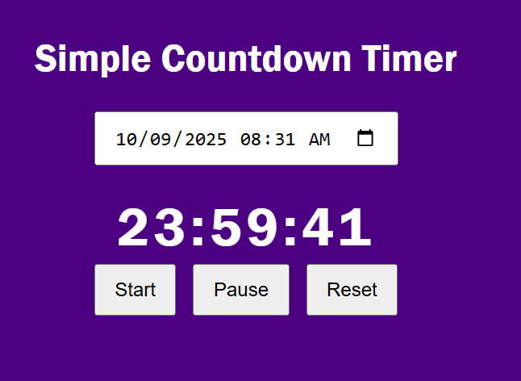
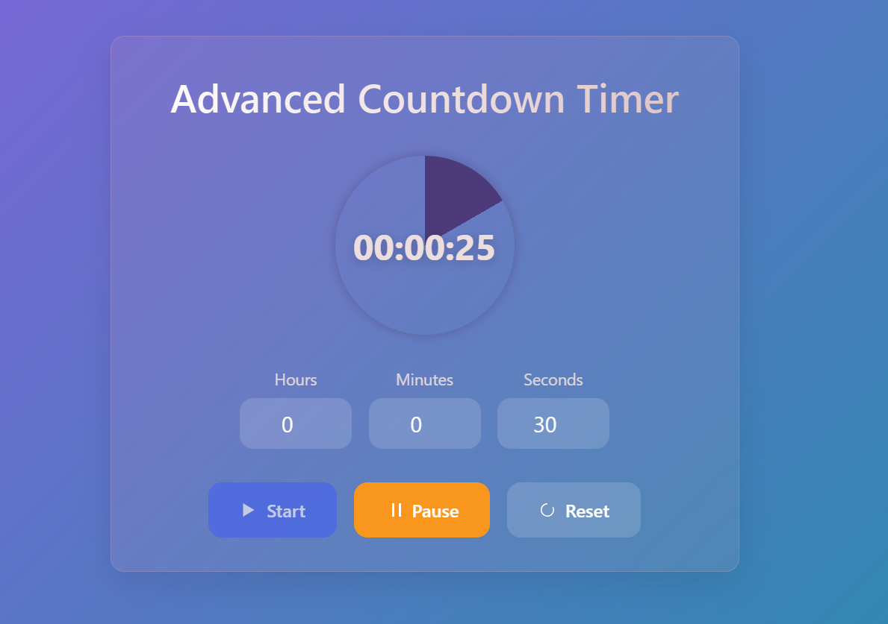
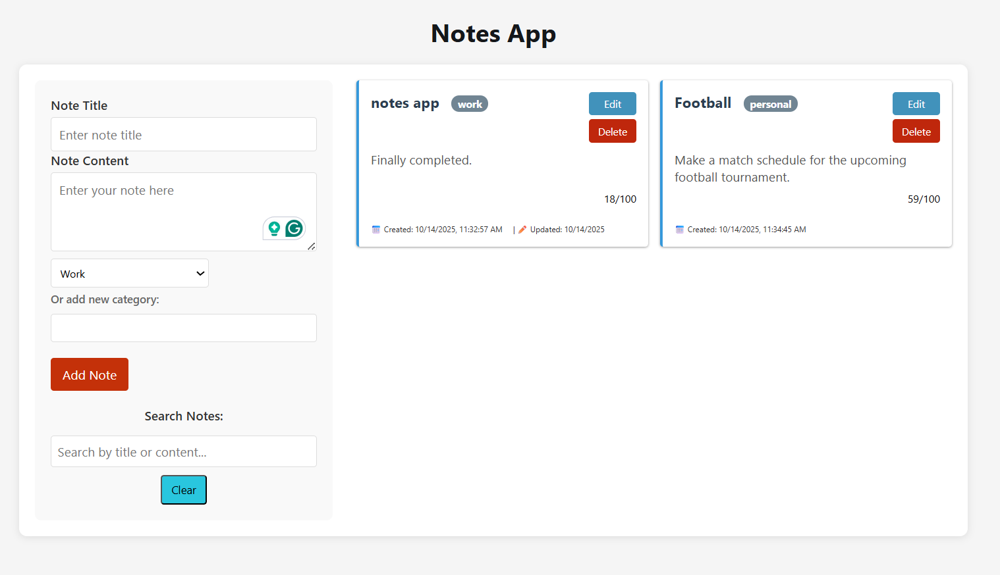
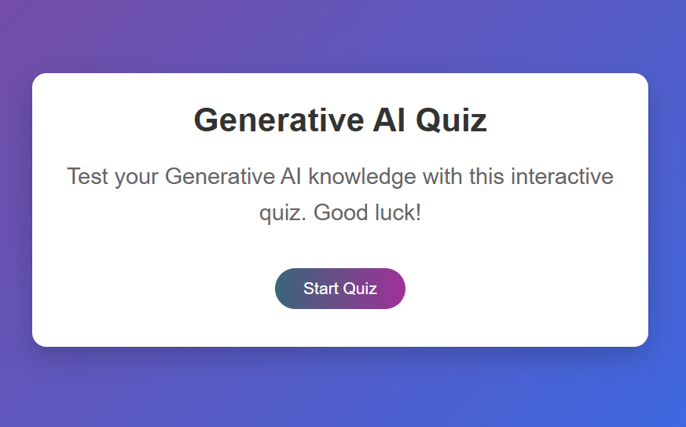
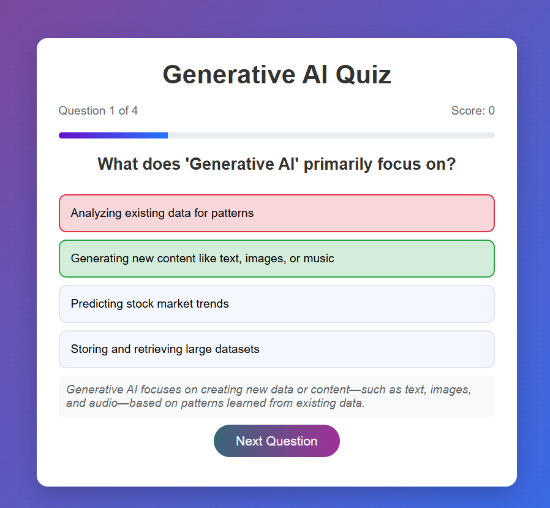
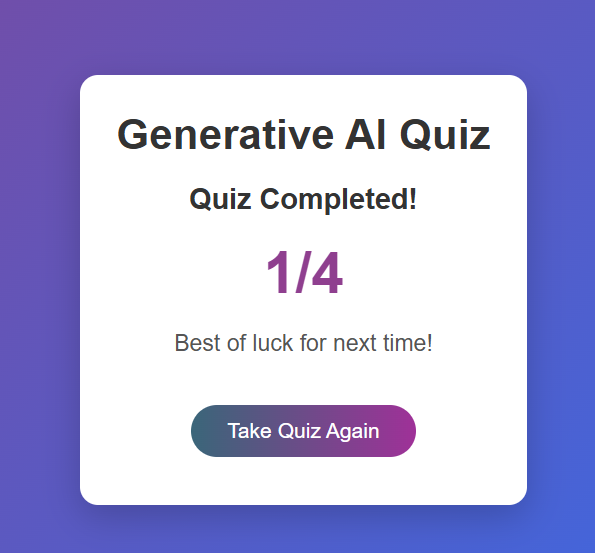
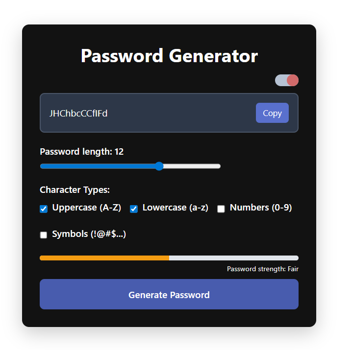

## **[1. Countdown Timer](./Countdown%20Timer)**

This project includes **two different countdown timer implementations** 
a **Simple Countdown Timer** and an **Advanced Countdown Timer**.

---

###  **Simple Countdown Timer**
####  Key Features:
- User can set a **target time** using a datetime input  
- Displays a **“Time is up!”** alert when countdown finishes  
- **Start / Pause / Reset** button controls  
- Uses `setInterval()` to update time every second  
- Supports **pause and resume** functionality  
- Beginner-friendly JavaScript implementation  
  

### ⏳ **Advanced Countdown Timer**
####  Key Features:
- Separate input fields for **hours, minutes, and seconds**  
- Built-in **input validation** (min–max limits)  
- **Dynamic circular progress bar** using CSS `conic-gradient`  
- **Start / Pause / Reset** control buttons  
- Automatically disables inputs while timer is running  
- Written using a **class-based OOP structure (`CountdownTimer`)**  
 
---

###  Screenshots

  
  

---

## **[2. Notes APP](./Notes%20App)**

A notes app that allows users to **create, edit, delete, categorize, and search notes** with real-time functionality and local storage. 

### Key Features:
- **Create, Edit & Delete Notes** - Add, modify and delete notes in real-time
- **Category Organization** - Organize notes by categories (Work, Personal, Study)
- **Instant Search** - Search through note titles and content
- **Local Storage** - Automatically saves notes in browser storage
- **Date Stamps** - See creation and update timestamps
- **Responsive Design** - Works on desktop and mobile devices
- **Keyboard Shortcuts** - Ctrl+Enter for quick note submission 

###  Screenshots

  
  

---
## **[3. Quiz App](./Quiz%20App)**

A interactive Generative AI quiz application that dynamically displays **multiple-choice questions, tracks user scores, and provides instant feedback**  all without any external frameworks.

###  Key Features:
- **Modular structure**  questions are imported from a separate file (`data/question.js`)  
- **Dynamic question & option rendering** using DOM methods (`createElement`, `appendChild`)  
- **Real-time progress bar** updates with each question using CSS width manipulation  
- **Interactive event handling** for Start, Next, and Restart buttons (`addEventListener`)  
- **Live score tracking** and instant feedback after each answer  
- **State management** for current question, selected option, and total score 
- **Smooth question transition** using `setTimeout()` for a short delay before showing the next question
- **Automatic screen transitions** between Start, Quiz, and Result screens   
- **Reusable utility functions** for resetting options and updating score  
- **Clean, JS-driven UI** without external frameworks  

###  Screenshots

  
  
  

---

## **[4. Password Generator](./Password%20Generator)**
A clean and interactive password generator web application that creates secure, customizable passwords with real-time strength feedback.

### Learning Outcomes:
- ES6 Classes and constructor patterns

- DOM event handling and user input management

- Local Storage API for data persistence

- Clipboard API for copy functionality

- CSS theme switching with JavaScript (Dark , Light)

- Password security assessment algorithms

###  Screenshots

  
  
  

---